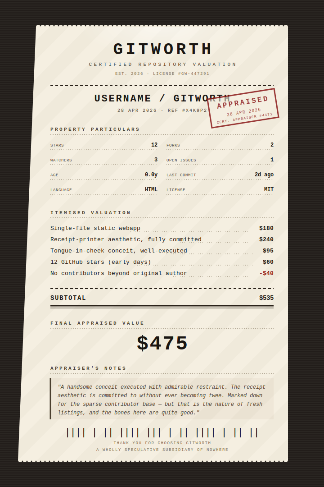

# GitWorth

  

> *GitWorth is an early-stage valuation method for software projects — starting from zero.*

Presented as a vintage receipt-printer certificate, GitWorth appraises any public GitHub repository with a line-itemed, human-readable "worth" — long before traditional metrics have anything meaningful to say.

## The Problem Beneath Repository Metrics

Most repository analytics systems are lagging indicators. They rely on:

- stars
- forks
- contributors
- long-term activity

Which means: they only become useful **after** value has already been established elsewhere.

For new projects — where the real uncertainty (and opportunity) exists — these systems return almost nothing.

A repo with:

- a novel idea
- strong intent
- early execution

...looks identical to an abandoned experiment.

## The Deeper Gap

Git already tracks:

- every commit
- every change
- every moment of creation

But it does not answer:

- What is this worth?
- What signals matter early?
- How do we interpret intent, taste, and direction — not just activity?

This creates a structural blind spot at the foundation of:

- early-stage software
- open source
- experimental projects
- AI-native workflows

## What GitWorth Does

GitWorth introduces a different approach: it treats a repository not just as code — but as a signal of emerging value.

Instead of waiting for scale, it produces a first-pass valuation from day one, using:

- observable metrics (stars, commits, contributors, cadence)
- structural signals (license, README presence, language mix)
- qualitative interpretation (via LLM appraisal)

The result is a line-itemed valuation, including:

- positive signals (e.g. "clear concept", "committed aesthetic", "early momentum")
- deductions (e.g. "no contributors", "incomplete documentation")
- a final appraised figure
- a short, characterful "appraiser's note"

## Why It's Different

GitWorth is not trying to be accurate. It's doing something more important:

> **It makes early-stage value legible.**

Where GitHub gives you raw data, GitWorth gives you interpretation.

Where typical tools say *"not enough data yet"*, GitWorth says *"here's what this might already be worth."*

## The Method (Emergent Valuation)

GitWorth combines four layers:

### 1. Structural Signals

Pulled from the GitHub API:

- stars, forks, watchers
- commit cadence
- repo age
- contributors (sampled)
- license + README presence
- language composition

### 2. Contextual Input

- README excerpt (intent, narrative, positioning)

### 3. Interpretive Layer

An LLM (via Anthropic's Claude API) generates:

- itemised valuation
- calibrated pricing logic
- narrative reasoning

### 4. Output Format

A receipt-style certificate:

- line items
- subtotal
- final "worth"
- appraiser commentary

## What It Actually Explores

Under the surface, GitWorth is an experiment in:

**Early-stage valuation systems** — how do you assign value before markets do?

**Human + machine judgment** — what happens when subjective appraisal is structured and repeatable?

**Alternative metrics** — what signals matter beyond stars and forks?

**Narrative as value** — how much does story, intent, and framing contribute to perceived worth?

## The Gamification Layer

GitHub already has a game running — it's just badly designed. Stars are a coordination signal masquerading as a metric, awarded asymmetrically (popular projects accumulate stars *because* they already have stars), arriving long after the work that earned them. The result is a status game with a single illegible scoreboard and feedback loops measured in years.

GitWorth introduces a richer game on top of the same primitives.

**Mechanism design over metric chasing.** A valuation broken into line items exposes the *rules*. Where stars compress everything into one number no contributor can directly act on, an itemised appraisal — *"clear concept: +$240; no license: -$60; steady commit cadence: +$95"* — makes each commit, README edit, and licensing decision a move with a visible payoff. That's the gap between an opaque popularity contest and a properly designed game.

**Repeated games beat one-shot games.** GitHub's native loop is roughly one-shot: build a repo, wait months, maybe accumulate stars. GitWorth makes the game **repeated and immediate** — re-appraise after every commit and watch the number move. Repeated games with visible scoring produce categorically different behaviour from one-shot ones; they reward iteration, course-correction, and patience over swing-for-the-fences launches.

**Private information becomes common knowledge.** Early-stage value is real but private — the maintainer can see the bones of a project; strangers can't. A standardised appraisal is a third-party **signalling device** that produces a publicly legible statement two outsiders can read and trust to roughly the same degree. Coordination needs common knowledge, not just shared information, and a line-itemed receipt is exactly the kind of focal point that lets a contributor, a maintainer, and a curious passerby converge on the same picture of what's there.

**Non-rivalrous scoring.** Stars are scarce — attention is finite and the top of any ranking is a fixed-size shelf, so the game is roughly zero-sum. Valuation isn't. A repo appraised at $475 doesn't reduce another's. Positive-sum games tend, in any reasonable mechanism design, to produce better long-run behaviour from participants.

The result isn't gamification in the cynical sense — points and badges grafted onto unrelated work. It's a more honest game than the one already running: rules that are visible, payoffs that are timely, and a scoreboard that isn't rivalrous.

## Not Just a Joke

Yes — it's playful. But it's also pointing at a real gap:

> There is currently no native way to express value at the moment of creation in software systems.

GitWorth is a first step toward:

- continuous valuation
- contribution-aware systems
- new economic layers on top of version control

## How It Works (Technical)

1. Enter an `owner/repo` slug
2. Fetch live data from `api.github.com`
3. Send structured signals + README excerpt to Claude
4. Receive structured JSON valuation
5. Render as a receipt-style certificate

No backend required — runs entirely in-browser.

## Deploying to GitHub Pages

This is a single [index.html](index.html) with no build step.

1. Push the file to a repo (root, or `/docs`, or a `gh-pages` branch — whichever your Pages settings expect).
2. Settings → Pages → Source = your branch.
3. Done. Visit the URL.

## A Note on API Keys

There's no backend. Keys you enter live in `localStorage` in your browser and are sent directly from your browser to:

- `api.github.com` (optional token, raises rate limit)
- `api.anthropic.com` (required, the Claude call)

The site host (GitHub Pages) never sees them. If you publish this for others to use, **don't bake your own keys in** — let visitors paste their own.

The Anthropic call uses the `anthropic-dangerous-direct-browser-access` header, which is required for direct-from-browser calls.

## Customising the Valuation Logic

The system prompt for Claude is in [index.html](index.html) inside `getValuation()`. Tweak the rules (line item count, tone, calibration anchors) and the output JSON schema there. The schema is parsed strictly, so if you add fields, update `renderResult()` too.

## Caveats

- Contributor count is sampled (first page, capped at 30)
- Commit cadence is based on recent history, not full lifetime
- Valuation is interpretive and speculative

This is not financial advice — it's a new lens.

## Positioning

> *"From metrics to meaning."*
>
> *"Value, before validation."*
>
> *"A receipt for something that doesn't yet have a price."*
